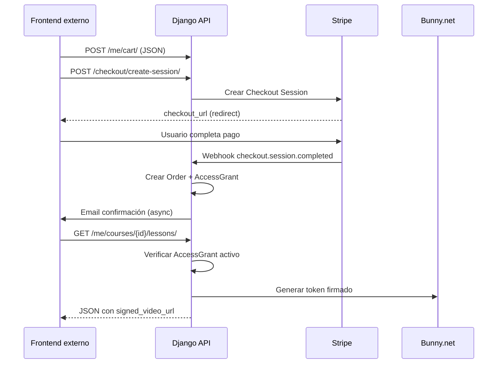

# Backend — Arquitectura y lineamientos

**Proyecto:** Recetario Backend (LMS + E-commerce APIs)  
**Alcance:** Solo backend Django/DRF — **sin frontend**  
**Referencia:** BEDERR-BACKEND  
**Despliegue:** Digital Ocean

> Plan de trabajo detallado: [`PLAN-DESARROLLO.md`](./PLAN-DESARROLLO.md)

---

## 0. Alcance del repositorio

| Incluido | Excluido |
|----------|----------|
| APIs REST JSON (`/api/v1/`) | Landing, paneles, carrito UI |
| Lógica de negocio, modelos, servicios | HTML/CSS/JS de la app web |
| Webhooks Stripe, integración Bunny.net | Reproductor de video en browser |
| Emails transaccionales (templates email) | Diseño responsive, SEO en HTML |
| OpenAPI (`/api/schema/`) | Proyecto `RECETARIO-FRONTEND` |

El frontend consume estas APIs desde un repositorio separado. Este backend solo configura **CORS** para permitir ese consumo.

---

## 1. Principios arquitectónicos

| # | Principio | Implicación |
|---|-----------|-------------|
| P1 | **API-only** | Solo DRF + Celery; cero vistas/templates de UI web |
| P2 | **Servicios para escrituras** | Toda mutación pasa por `services/` con `@transaction.atomic` |
| P3 | **Defensa en profundidad** | Permisos DRF + verificación en servicios + constraints DB |
| P4 | **Contrato estable** | Envelope JSON, errores con `code` + `message`; documentar en OpenAPI |
| P5 | **Identidades separadas** | `StaffUser` (admin) ≠ `UserAccount` (cliente) |
| P6 | **Acceso verificable** | Purchase/AccessGrant antes de devolver URL de video |
| P7 | **SQLite local, Postgres prod** | Dev rápido; CI/prod en PostgreSQL |

---

## 2. Flujo de compra y acceso

---

## 3. Autenticación

| Actor | Modelo | JWT type | Endpoint |
|-------|--------|----------|----------|
| Cliente | `UserAccount` | `user` | `POST /api/v1/auth/login/` |
| Admin | `StaffUser` | `staff` | `POST /api/v1/admin/auth/login/` |

Google OAuth: flujo authorization code → crear/vincular `UserAccount`.

---

## 4. Integraciones externas

### Stripe
- Checkout Session para pagos one-time
- Webhook: `checkout.session.completed`, `payment_intent.payment_failed`
- Metadata en session: `user_id`, `cart_item_ids`

### Bunny.net Stream
- Admin registra `bunny_video_id` por lección/receta vía API admin
- Backend genera signed URL con expiración corta (1–4 horas)
- La API devuelve `signed_video_url` en JSON; el **frontend externo** renderiza el player

### Digital Ocean Spaces
- Imágenes de portada, thumbnails
- `django-storages` con backend S3
- CDN opcional delante de Spaces

---

## 5. Jobs Celery

| Task | Frecuencia | Acción |
|------|------------|--------|
| `send_welcome_email` | On signup | Email bienvenida |
| `send_purchase_confirmation` | On webhook | Email compra |
| `expire_access_grants` | Diario | Marcar accesos vencidos |
| `process_stripe_webhook` | On event | Procesar pago async |

---

## 6. Testing

- `pytest` + `pytest-django`
- Factories en `tests/factories/`
- CI: PostgreSQL 16 service container
- Local: SQLite in-memory (rápido)
- Stripe: usar `stripe-mock` o test keys
- Cobertura mínima: servicios de commerce, content access, auth

---

## 7. Documentos relacionados

- [`PLAN-DESARROLLO.md`](./PLAN-DESARROLLO.md) — Fases y cronograma (solo backend)
- [`docs/apis/README.md`](./apis/README.md) — Documentación de endpoints
- `.cursor/rules/` — Reglas para agentes Cursor
- `../RECETARIO-FRONTEND/` — Frontend (proyecto separado, fuera de alcance)
