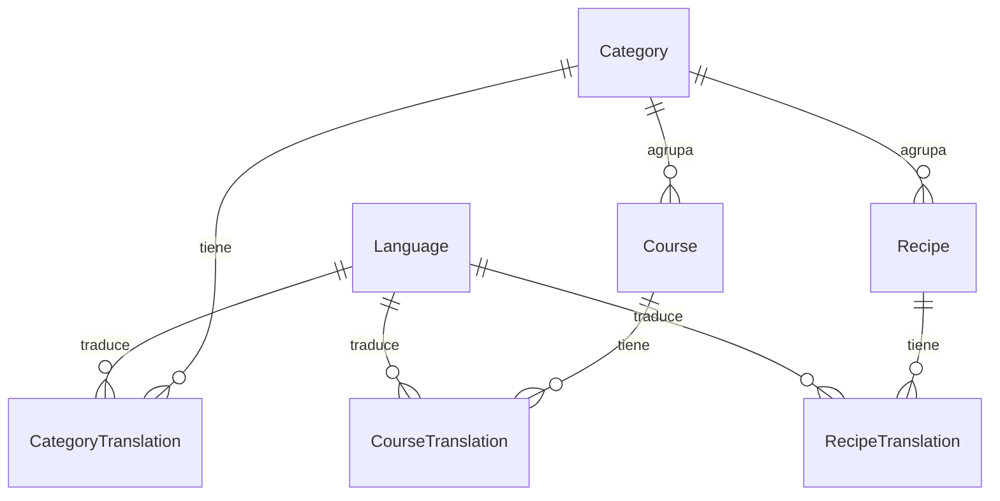

# Admin — Idiomas y sistema multi-idioma

Gestión de idiomas disponibles en la plataforma y cómo se relacionan con el contenido traducible.

**Prefijo:** `/api/v1/admin/`  
**Auth:** `Authorization: Bearer <access_staff>`

## Endpoints

| Método | Ruta | Descripción |
|--------|------|-------------|
| GET | `/languages/` | Listar todos los idiomas |
| POST | `/languages/` | Crear idioma |
| GET | `/languages/{code}/` | Detalle por código (`es`, `en`, …) |
| PATCH | `/languages/{code}/` | Actualizar nombre o activar/desactivar |
| DELETE | `/languages/{code}/` | Eliminar (falla si hay traducciones asociadas) |

---

## Cómo funciona el multi-idioma

La plataforma separa **dos conceptos**:

### 1. Idioma (`Language`)

Tabla maestra de idiomas soportados. Cada registro tiene:

| Campo | Descripción |
|-------|-------------|
| `code` | Código ISO corto, único (`es`, `en`, `fr`…) |
| `name` | Nombre legible (`Español`, `English`) |
| `is_active` | Si está disponible en catálogo público y en formularios admin |

Los idiomas se crean **una sola vez** en admin. El contenido no se duplica entero: cada curso/receta/categoría es **un solo registro** con varias filas de traducción.

### 2. Traducciones (`*Translation`)

Categorías, cursos y recetas tienen tablas hijas de traducción:

| Entidad | Tabla | Campos traducidos |
|---------|-------|-------------------|
| Categoría | `CategoryTranslation` | `name`, `description` |
| Curso | `CourseTranslation` | `title`, `description`, `meta_title`, `meta_description` |
| Receta | `RecipeTranslation` | `title`, `description`, `meta_title`, `meta_description` |

Cada traducción enlaza `(entidad, language)` de forma única: un curso puede tener una fila para `es` y otra para `en`, pero no dos filas en el mismo idioma.

### Flujo típico en admin

```
1. Crear idioma        POST /admin/languages/     { "code": "fr", "name": "Français" }
2. Crear curso         POST /admin/courses/       { ..., "translations": [ { "language_code": "es", ... }, { "language_code": "fr", ... } ] }
3. Publicar            PATCH /admin/courses/{slug}/   { "status": "published" }
```

Para **añadir un idioma nuevo** a contenido existente: `PATCH` del curso/receta/categoría enviando el array `translations` completo (reemplaza todas las traducciones).

### Catálogo público

Los visitantes eligen idioma con query param:

```http
GET /api/v1/public/courses/?lang=es
GET /api/v1/public/courses/pasta-101/?lang=en
```

| Regla | Comportamiento |
|-------|----------------|
| `?lang=` omitido | Default `es` |
| Idioma inactivo (`is_active=false`) | 404 `LANGUAGE_NOT_FOUND` |
| Curso sin traducción en ese idioma | **No aparece** en listados ni detalle |
| Solo `status=published` | Visible en APIs públicas |

`GET /api/v1/public/languages/` devuelve solo idiomas con `is_active=true` (para selector en frontend).

### Seed inicial

En desarrollo/CI:

```bash
python manage.py seed_languages   # crea es + en si no existen
# o
make seed-languages
```

---

## Crear idioma

```http
POST /api/v1/admin/languages/
Content-Type: application/json
```

```json
{
  "code": "fr",
  "name": "Français",
  "is_active": true
}
```

**Response 201**

```json
{
  "data": {
    "id": "uuid",
    "code": "fr",
    "name": "Français",
    "is_active": true,
    "created_at": "2026-06-28T12:00:00Z",
    "updated_at": "2026-06-28T12:00:00Z"
  },
  "meta": {}
}
```

## Activar / desactivar idioma

Preferir desactivar antes que eliminar:

```http
PATCH /api/v1/admin/languages/en/
Content-Type: application/json

{ "is_active": false }
```

- Desactivar oculta el idioma del catálogo público y de `GET /public/languages/`.
- El contenido traducido **permanece** en BD; al reactivar vuelve a mostrarse.

## Formato `translations` en otros CRUD

Al crear o editar categorías, cursos o recetas, el body incluye:

```json
"translations": [
  {
    "language_code": "es",
    "title": "Título en español",
    "description": "…",
    "meta_title": "SEO",
    "meta_description": "…"
  }
]
```

Para **categorías** usar `name` en lugar de `title`:

```json
{ "language_code": "es", "name": "Postres", "description": "…" }
```

En `multipart/form-data` (p. ej. subir imagen), enviar `translations` como **string JSON**.

---

## Errores

| HTTP | code | Cuándo |
|------|------|--------|
| 409 | `LANGUAGE_ALREADY_EXISTS` | Código duplicado |
| 422 | `LANGUAGE_NOT_FOUND` | `language_code` inexistente al guardar traducciones |
| 404 | — | Idioma no encontrado o inactivo en API pública |
| 401 | — | Sin JWT staff |

## Diagrama de relaciones


